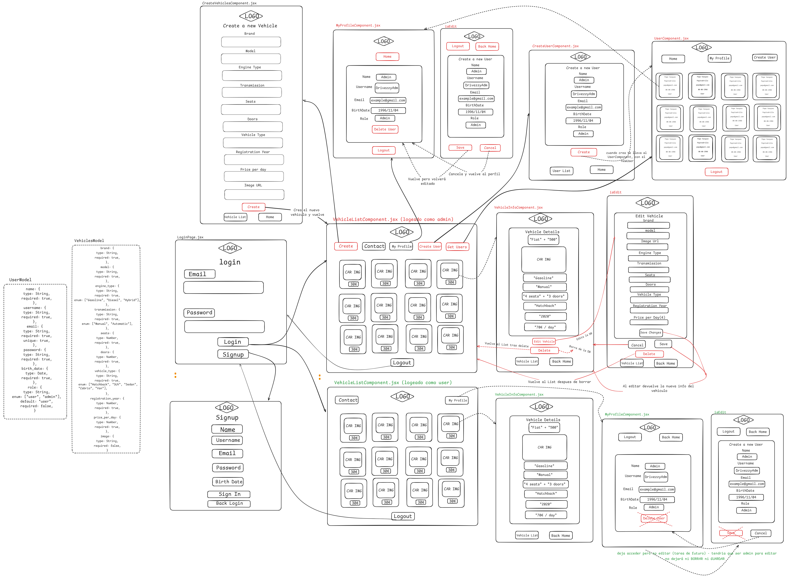

# DRIVEZZY RENT A CAR

Para poder crear una página web de un Rent a Car funcional he tenido que crear una estructura de Back y Front, para crear un dinamismo entre los elementos y un fácil acceso a los usuarios.

**Funcionalidades de la aplicación**: Encontraremos una app con diferentes opciones como la de Listar productos, listar usuarios, acceder a un usuario por Id, acceder a un producto por id, Crear productos, Crear usuarios, editar usuario, editar productos, pagina de Contacto y HomePage (con trabajo aun pendiente en el). Y obviamente tendremos funcionalidades para el Login / Register.

Todo el proyecto del front estará relacionado con una base de datos creada en **MongoDB** (**Atlas**) para el mejor manejo de la misma.

En este proyecto trabajaremos con los diferentes lenguajes: **React**, **Redux**, **Hooks de React**, **JavaScript**, **HTML**, **CSS5**, **MongoDB**.

### **BACKEND** -> imprescindible realizar **npm i** al iniciar back

Lo primero fue la creación de las **bases de datos** con la que trabajar. Para ello creé dos **modelos**:

- **userModel**: "_name_", "_username_", "_email_", "_password_", "_birth_date_" y "_role_" (que vendrá user como default).
- **vehiclesModel**: "_brand_", "_model_", "_engine_type_", "_transmission_", "_seats_", "_doors_", "_vehicle_type_", "registration*year*", "_price_per_day_", "\_image". (todas requeridas para la creación a excepción de la imagen).

Se creará un secret.js para establecer la contraseña del .env. Ademas de diferentes funciones como el generateToken, funciones para comprobar la edad, templates (para enviar email al registrarse con datos de la empresa).
Tambien añadir los **middlewares** para poder controlar mejor los accesos con diferentes verify, como el verifyAdmin/age/tokens/payload/passwordSecret/passwordSecretRefresh.

Creación de **controladores** de productos y usuarios donde organizaremos los EndPoints de nuestra applicacion, ya sea la creacion de un producto (**POST**), obtención de un producto/user por id o todo el listado de los productos/users (**GET**), edición de un producto/user(**PATCH**) y la eliminacion de un producto/user (**DELETE**). También la creación de un **routes** para poder enrutar todo acorde a lo que trabajamos. Todas los endpoints fueron comprobados previamente con ThunderClient (visualStudioCode), incluyendo manejadores de errores.

El puerto donde trabajaremos en el backend será el 8000. [localhost:](http://localhost:8000/vehicles) para los vehiculos y [localhost:](http://localhost:8000/user) para los user.

Las dependencias instaladas en el back seran estas:

- npm init -y
- npm i cors
- npm i express
- npm i mongoose
- npm install -save-dev nodemoon
- npm i nodemailer
- npm i date-fns
- npm i dotenv
- npm i bcrypt
- npm i jsonwebtoken
- npm i pdfkit -> instalado para futuro

devDependencies:

- nodemon

Crearemos un archivo .gitignore que contendrá -> /node_modules y el .env (a futuro, no lo añadimos ahora porque el proyecto seguirá avanzando y será mas facil para la observacion del proyecto, aunque sea lo correcto incluirlo)

Para arrancar el servicio en el back lo haremos con un:

- **npm run dev**

### **FRONT** -> imprescindible realizar **npm i** al iniciar front

Creación de un esquema en excalidraw para una mejor visualización de las funcionalidades del proyecto.

En cuanto al Front trabajaremos con React principalmente. El proyecto se crea con un primer **npm create vite@latest "..."**. Tras la creacion del back, podemos trabajar en el front para ir dandole "vida" a nuestras funcionalidades.

Crearemos los **componentes** donde se realizaran todas las acciones de nuestra aplicación, ya sea conexión con otros componentes atómicos, reducers y actions. Tambien estuve navegando para averiguar la forma de incluir SVG's en REACT, no encontre otra forma que creando un componente con su css correspondiente y luego importandolo atomicamente donde yo quisiera utilizarlo (en este caso en el ContactPage.jsx para las redes sociales creadas) y algun svg para los detalles de los vehiculos(puertas y asientos).

También tendremos las **pages** para poder atomizar aun más nuestra aplicación. Nada mas acceder entraremos en la LoginPage, desde donde tendremos acceso a todas las funcionalidades de nuestra aplicacion navegando gracias al router. Encontraremos el login, para poder acceder y si no tuvieramos cuenta la podriamos crear en el mismo "Register" justo debajo, pudiendo así acceder.

Conseguiremos esa conexión con el backend gracas a los fetch que realizaremos para obtener los endpoints en nuestra aplicación.

En cuanto a los estilos, he estado utilizando React Bootstrap y he añadido estilos globales para casi toda mi aplicacion, he intentado que fuera lo más responsive posible.

Las dependencias instaladas en el front son:

- npm i
- npm install redux react-redux
- npm install --save react-router-dom
- npm i react-bootstrap
- npm i yup (no me dio tiempo, pero lo utilizaré para los form y tener mejor las validaciones)
- npm i formik (no me dio tiempo, pero lo utilizaré para los form y tener mejor las validaciones)

No me detengo mucho más explicando el front ya que creo que con el esquema de excalidraw queda bastante clara la funcionalidad del proyecto con toda la simulacion de botones, acciones, etc... Solo comentar que los campos en **rojo** serán solo accesibles para **admin** (si logeara un admin) y los campos en **verde** serán los que verás si logeas como **user** (limitando obviamente las funcionalidades).

Queda por mejorar mucho el proyecto, hay funcionalidades como por ejemplo la de editar el perfil, que sería lo ideal que un **user** pudiera modificar / eliminar su propio usuario, pero todavía no he dado con la tecla (porque cree el endpoint para que esas funciones sean unicamente con el verifyAdmin/verifyToken). Añadir también que me hubiese gustado tener un carrito, el cual tuve que dejar de lado por falta de tiempo (eliminé del proyecto las lineas de codigo dedicadas a ello por no "ensuciar" el código, pero le daré otra vuelta, al igual que añadir metodos de pago y botones para "reservar" el vehiculo).

Para arrancar el servicio en el front lo haremos con un:

- npm run dev

 

## ¡RECORDATORIO! Para iniciar ambos proyectos (front y back) debes realizar un:

- **npm i** (al iniciar ambos proyectos)

 

#### **HÉCTOR MARISCAL MANZANO**

_Email de contacto_: mariscalmanzanohector@gmail.com
